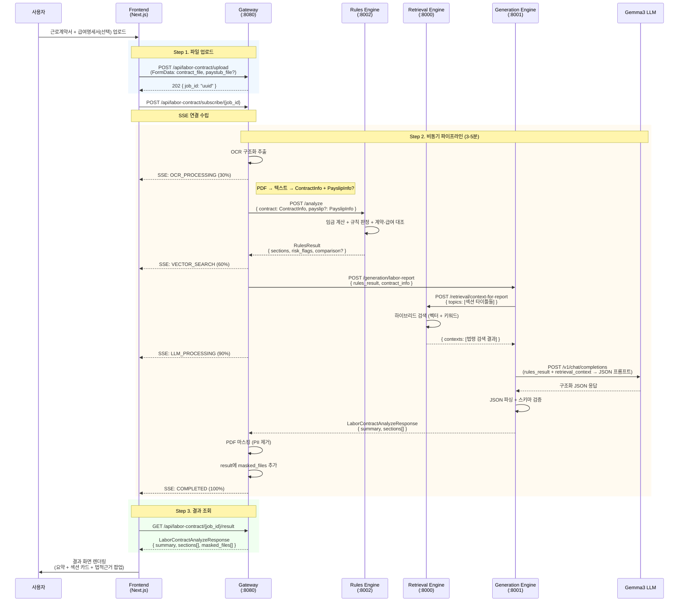
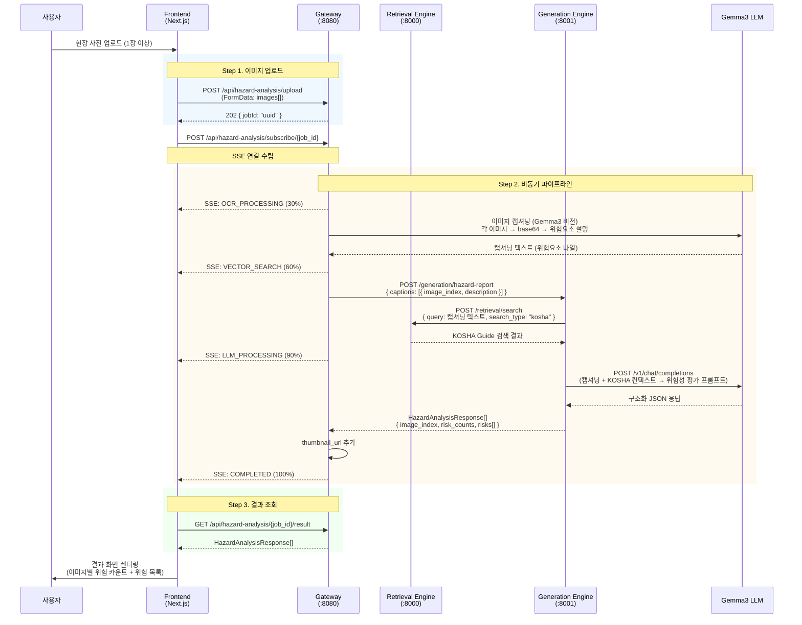
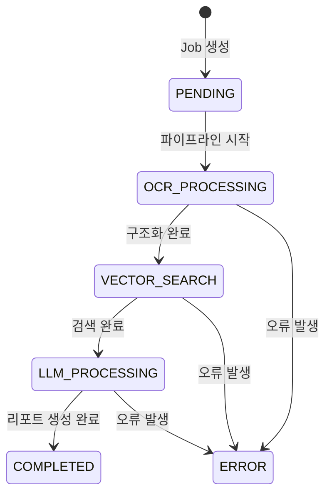
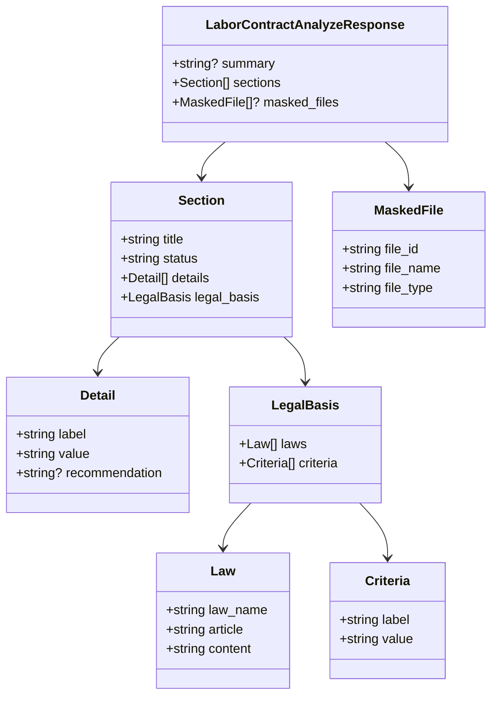
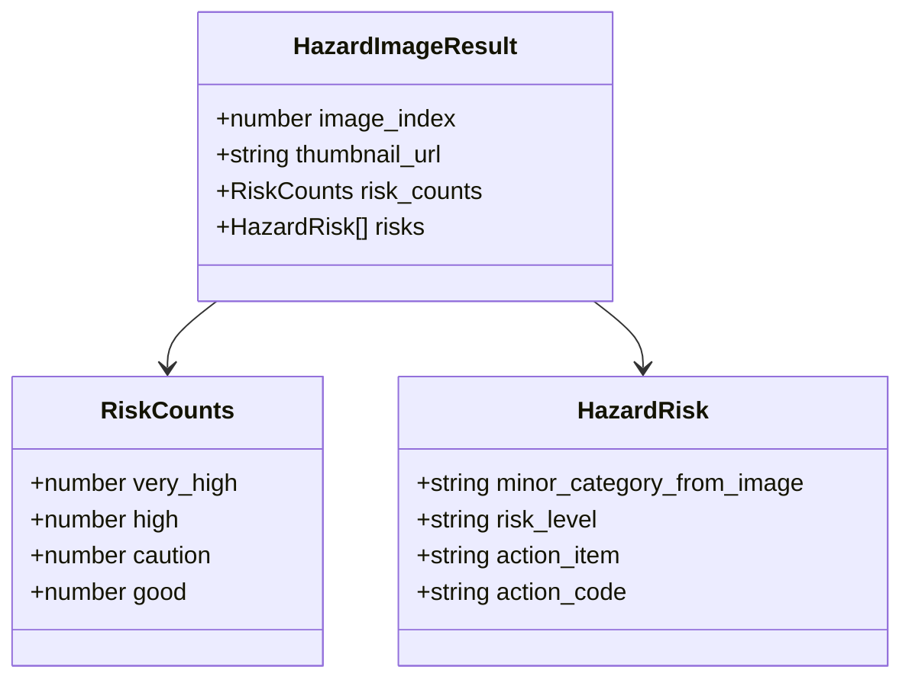
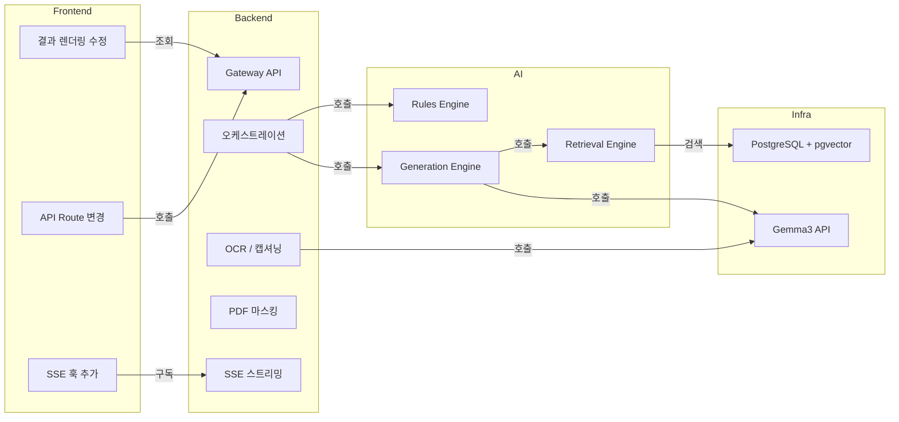

# HANDOFF: 전체 통합 뷰

> AI / 백엔드 / 프론트엔드 3개 파트가 어떻게 데이터를 주고받는지 한눈에 보는 문서.
> 상세 내용은 각 파트별 HANDOFF 문서 참조.

---

## 1. 전체 시스템 구조

```
┌─────────────┐      ┌──────────────┐      ┌──────────────────────────────┐
│  Frontend   │      │   Gateway    │      │         AI Engines           │
│  (Next.js)  │ REST │   (:8080)    │ HTTP │                              │
│             │─────▶│              │─────▶│  Rules    :8002              │
│             │◀─────│  오케스트레이션 │◀─────│  Retrieval :8000             │
│             │ SSE  │  OCR/마스킹   │      │  Generation :8001            │
└─────────────┘      └──────────────┘      └──────────────────────────────┘
                            │                         │
                     ┌──────┴───────┐          ┌──────┴───────┐
                     │  PostgreSQL  │          │   Gemma3     │
                     │  + pgvector  │          │   (외부 LLM) │
                     └──────────────┘          └──────────────┘
```

### 파트별 담당

| 파트 | 담당 | 상세 문서 |
|------|------|-----------|
| **AI** | Retrieval / Rules / Generation 엔진 내부 로직 | `HANDOFF_FOR_AI.md` |
| **백엔드** | Gateway, 오케스트레이션, SSE, OCR, 마스킹 | `HANDOFF_FOR_BACKEND.md` |
| **프론트** | API 호출 변경, SSE 구독, 결과 렌더링 | `HANDOFF_FOR_FRONTEND.md` |

---

## 2. 근로계약서 분석 - Mermaid Sequence



---

## 3. 산재위험요소 분석 - Mermaid Sequence



---

## 4. 파트 간 데이터 인터페이스

### 4.1 프론트 → 백엔드 (API 호출)

| API | 프론트가 보내는 것 | 백엔드가 반환하는 것 |
|-----|-------------------|---------------------|
| `POST /api/labor-contract/upload` | FormData { contract_file, paystub_file? } | `{ job_id }` |
| `POST /api/labor-contract/subscribe/{id}` | (연결만) | SSE 이벤트 스트림 |
| `GET /api/labor-contract/{id}/result` | (없음) | `LaborContractAnalyzeResponse` |
| `GET /api/labor-contract/masked/{fileId}` | (없음) | Binary (PDF/Image) |
| `POST /api/hazard-analysis/upload` | FormData { images[] } | `{ jobId }` |
| `POST /api/hazard-analysis/subscribe/{id}` | (연결만) | SSE 이벤트 스트림 |
| `GET /api/hazard-analysis/{id}/result` | (없음) | `HazardAnalysisResponse[]` |
| `GET /api/hazard-analysis/{fileId}` | (없음) | Binary (Image) |

### 4.2 백엔드 → AI (내부 API 호출)

| API | 백엔드가 보내는 것 | AI가 반환하는 것 |
|-----|-------------------|-----------------|
| `POST :8002/analyze` | `{ contract, payslip?, assumptions }` | `RulesResult { sections, risk_flags, comparison? }` |
| `POST :8001/generation/labor-report` | `{ rules_result, contract_info }` | `{ summary, sections[] }` |
| `POST :8001/generation/hazard-report` | `{ captions[] }` | `[{ image_index, risk_counts, risks[] }]` |

### 4.3 AI 내부 (Generation → Retrieval)

| API | Generation이 보내는 것 | Retrieval이 반환하는 것 |
|-----|----------------------|----------------------|
| `POST :8000/retrieval/context-for-report` | `{ topics[], search_type }` | `{ contexts: [{ topic, results[] }] }` |
| `POST :8000/retrieval/search` | `{ query, top_k, search_type }` | `{ results: [{ content, score, citation }] }` |

---

## 5. SSE 상태 흐름



| 상태 | 진행률 | 근로계약서 | 산재위험 |
|------|--------|-----------|---------|
| `PENDING` | 0% | 작업 대기 중 | 작업 대기 중 |
| `OCR_PROCESSING` | 30% | 근로조건 분석 중 | 현장 사진 분석 중 |
| `VECTOR_SEARCH` | 60% | 법령 검색 중 | KOSHA 가이드 검색 중 |
| `LLM_PROCESSING` | 90% | 리포트 생성 중 | 위험성 평가 생성 중 |
| `COMPLETED` | 100% | 분석 완료 | 분석 완료 |
| `ERROR` | - | 오류 메시지 | 오류 메시지 |

---

## 6. 최종 응답 스키마

### 6.1 LaborContractAnalyzeResponse



**status 값:** `"준수"` | `"미준수"` | `"주의"`

### 6.2 HazardAnalysisResponse



**risk_level 값:** `"매우 위험"` | `"위험"` | `"주의"` | `"양호"`

---

## 7. 파트별 의존 관계



### 구현 순서 의존성

```
Phase 1: 인프라 (Docker, DB)
    ↓
Phase 2: Retrieval Engine ──────┐
Phase 3: Rules Engine ──────────┤ (병렬 가능)
    ↓                           ↓
Phase 4: Generation Engine (Retrieval 필요)
    ↓
Phase 5: Gateway (3개 엔진 필요)
    ↓
Phase 6: Frontend (Gateway 필요)
    ↓
Phase 7: 통합 테스트
```

---

## 8. 협업 체크리스트

### AI ↔ 백엔드 합의 필요

- [ ] `ContractInfo` / `PayslipInfo` 필드명 확정
- [ ] `RulesResult.comparison` 응답 구조 확정
- [ ] `LaborContractAnalyzeResponse` 스키마 최종 확정
- [ ] `HazardAnalysisResponse` 스키마 최종 확정
- [ ] 에러 응답 형식 통일: `{ "error": string, "detail": string }`
- [ ] 각 엔진 `/health` 엔드포인트 형식

### 백엔드 ↔ 프론트 합의 필요

- [ ] CORS 허용 origin 확인
- [ ] SSE `Content-Type: text/event-stream` 확인
- [ ] FormData 필드명: `contract_file`, `paystub_file`, `images`
- [ ] 파일 크기 제한: 10MB
- [ ] 에러 응답 → 프론트 에러 UI 매핑

### AI ↔ 프론트 (직접 통신 없음, 스키마 합의)

- [ ] `sections[].status` 값 3종 확정 ("준수" / "미준수" / "주의")
- [ ] `legal_basis` 구조 확정 (laws + criteria)
- [ ] 급여명세서 대조 섹션 타이틀 확정
